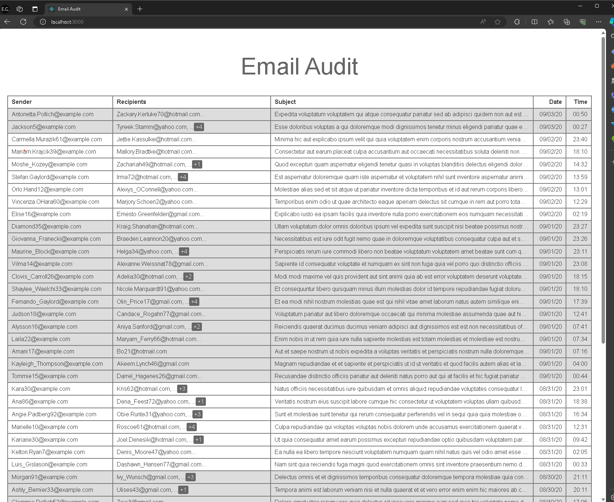
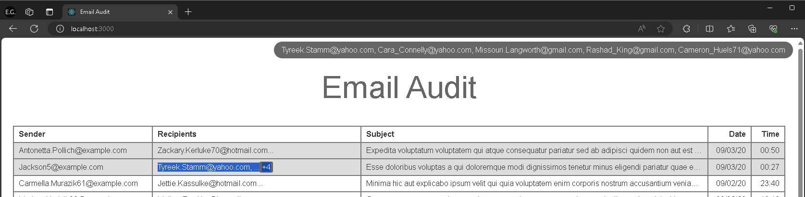

# Email Audit

Email Audit is a system used to audit all emails sent from within an organization. 

## Technologies

- React
- TypeScript

## Screenshots

### MAIN SCREEN


### TOOLTIP



## Development

Install dependencies and then start in the development mode.

```bash
npm install
npm run dev
```

Navigate to the port that was displayed on the terminal. The app should be running after the development build is finished.

## Build

To generate production version:

```bash
npm run build
```

You can run the newly built app locally with `npm run preview`.

## Features

- Display mocked email data from `fake-data.ts` to simulate an API response. 

- Table rows have alternating background colors between dates to make it easier to distinguish emails sent on different dates.
